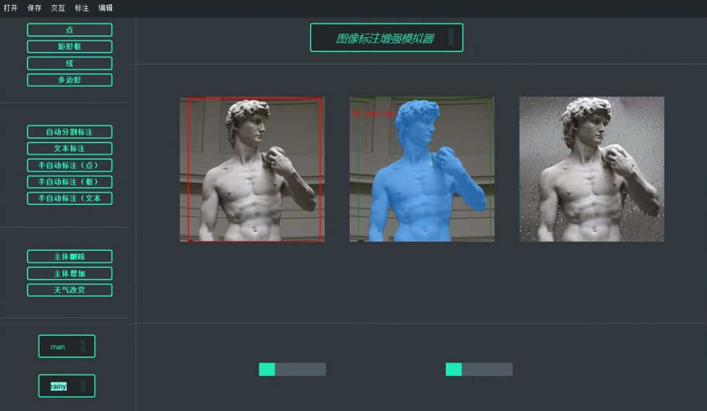

## 程序启动
使用办法有以下两种
1. GUI程序运行
2. Gradio运行

以下分别介绍两种方式的使用说明，运行要求本地显存较大，GPU为3090及以上

首先將Pretrain_models文件夹移入Project文件夹中，并需要配置python环境

PS：若不想配置环境可直接复制我们配置好的环境到本地 anaconda的子文件夹envs中，所在目录为 '素材与源码/sam'，亲测运行没有问题

### GUI程序运行
环境配置
```commandline
cd project/
pip install -r requirements.txt
```


运行
```commandline
python main_gui.py
```


### Gradio运行
环境配置
```commandline
cd project/
pip install -r requirements.txt
```
运行
```commandline
python main_gradio.py
```


## 程序使用说明
### GUI
GUI程序结构如图
以下为各个菜单栏选项/按键的功能：
1. 打开：打开本地的图片
2. 保存：保存标注后的json文件
3. 按键栏区域一：选择不同的交互形式
4. 按键栏区域二：在用户进行交互后选择对应的标注操作，例如：框选图片后，选择半自动标注（框）；自动分割标注和文本标注不需要提前进行交互，为自动标注；半自动标注（文本）需要用户提前在文本框一输入文本prompt
5. 按键栏区域三：在进行标注后对图片进行编辑，例如对图片进行半自动标注（框）后得到主体的分割结果，之后可以进行主体的删除以及背景天气的改变；主体增加在框选操作之后进行即可，不需要进行标注
更加具体的操作见文档的测试分析部分以及演示视频

### Gradio
1. 全自动标注：输入本地图片和图片路径，点击Button（自动文本标注和自动分割标注）即可完成标注。
2. 半自动标注：
    1. 基于文本的标注，输入图片和分割prompt后，点击Button即可完成标注    
    2. 基于框的标注和基于点的标注，输入图片和图片路径后，点击Button在弹出的界面完成编辑后，按Esc键退出编辑。
3. 编辑：
    1. 主体删除：在完成标注操作后点击Button即可完成删除; 
    2. 主体增加，先进行基于框的标注框选需要增加主体的位置，再输入编辑prompt，点击Button即可完成天气改变; 
    3. 天气改变：输入编辑prompt、图片和掩膜，点击Button即可完成天气改变。
4. 手动标注：输入本地图片和图片路径，点击标注方式的Button后，在弹出的界面完成标注，按Esc键即可退出
5. 保存json文件，在标签提示框输入标注物体的类别后，点击Button即可完成json文件的生成，json文件的命名是类别+保存时间。

注意事项：所有弹出界面的编辑都可以通过Esc键退出，多边形标注在完成一个多边形的生成后会自动退出，同时也可以提前按Esc键退出。
